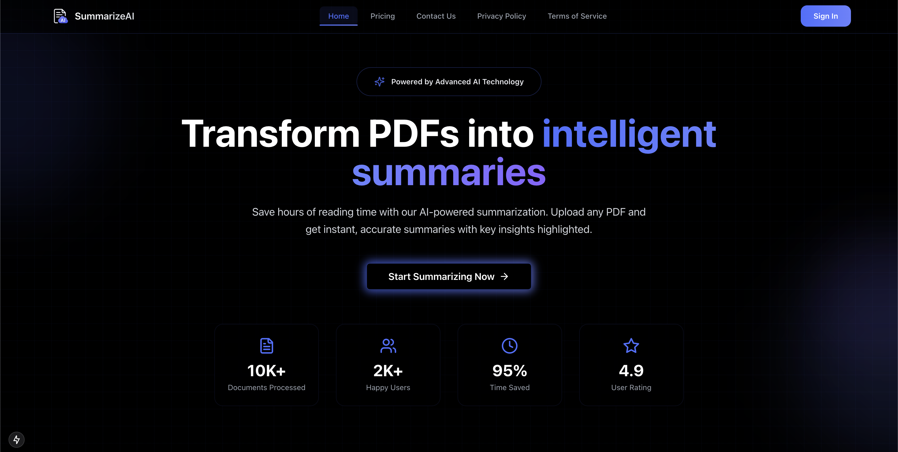

# SummarizeAI

SummarizeAI is a powerful AI-driven SaaS tool that converts lengthy PDF documents into clear, concise summaries in seconds. Whether you're a student, researcher, or busy professional, SummarizeAI helps you save time and extract key insights effortlessly.

🚧 **Project Status: In Development** 🚧
This project is currently under active development. Features are being added and refined regularly.

[](https://summarize-ai-eta.vercel.app)

## ✨ Features

- 📝 Clear, structured summaries with key points and insights
- 🎨 Beautiful, interactive summary viewer with progress tracking
- 🔒 Secure file handling and processing
- 🔐 Protected routes and API endpoints
- 📊 User dashboard for managing summaries
- 📱 Responsive design for mobile and desktop
- 🔄 Real-time updates and path revalidation
- 🚀 Production-ready deployment
- 🔔 Toast notifications for upload status, processing updates, and error handling
- 📈 Performance optimizations
- 🔍 SEO-friendly summary generation
- 🗂️ Markdown Export that can be converted into a blog post
- 🔑 Secure authentication with JWT and Edge Runtime support

## 🛠️ Core Technologies

- 🚀 Next.js 15 App Router for server-side rendering, routing, and API endpoints with Server Components and Server Actions
- ⚛️ React 19 for building interactive user interfaces with reusable components
- 🤖 GPT-4 | Gemini powered summarization with contextual understanding and emoji-enhanced output
- 🧠 Langchain for PDF parsing, text extraction, and document chunking
- 🎨 ShadcN UI for accessible, customizable React components
- 💾 NeonDB (PostgreSQL) for serverless database storage with Drizzle ORM
- 📤 UploadThing for secure PDF uploads (up to 32MB) and file management
- 🔔 Toast notifications for user feedback
- 📜 TypeScript for static typing and enhanced development experience
- 💅 TailwindCSS 4 for utility-first, responsive styling
- 🚀 Deployment on Vercel
- 🔐 Authentication with jose for Edge-compatible JWT operations
- 🍪 Cookie management with universal-cookie
- ✅ Form validation with Zod

## Database Setup

The project uses NeonDB (PostgreSQL) with Drizzle ORM for database management. The schema includes:

- Users table with secure password hashing
- Document storage and management
- Summary tracking and user preferences

## Installation

1. Clone the repository:
   ```bash
   git clone https://github.com/codewithalihamza/SummarizeAI.git
   ```

2. Install dependencies using NPM:
   ```bash
   npm install
   ```

3. Set up your environment variables:
   Create a `.env` file in the root directory with:
   ```env
   DATABASE_URL="your_neondb_connection_string"
   ```

4. Run database migrations:
   ```bash
   npm run db:generate
   npm run db:push
   ```

## Usage

To start the development server:

```bash
npm run dev
```

To build the project for production:

```bash
npm run build
```

To start the production server:

```bash
npm run start
```

## Current Development Status

🚧 **Features in Progress:**
- User authentication system with secure session management
- PDF processing pipeline optimization
- Advanced summary customization options
- Enhanced error handling and user feedback
- Performance optimizations for large documents

## Documentation Links

- [react-icons documentation](https://react-icons.github.io/react-icons/)
- [react-hook-form documentation](https://react-hook-form.com/get-started)
- [zod documentation](https://zod.dev/)
- [Shadcn/UI documentation](https://ui.shadcn.com/docs)
- [Next.js documentation](https://nextjs.org/docs)
- [Langchain documentation](https://js.langchain.com/docs/)
- [NeonDB documentation](https://neon.tech/docs)
- [UploadThing documentation](https://uploadthing.com/docs)
- [Drizzle ORM documentation](https://orm.drizzle.team/docs/overview)

## Contributing

While this project is still in development, contributions are welcome! Please feel free to submit issues and pull requests.
